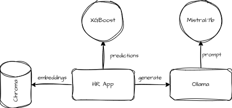

# Sombra Recruitment System

A human resource system that helps recruiters select better job candidates.


## Features

- Responsive UI
- User authentication (simple login/register)
- Applicant management
- Job vacancy management
- Candidates recommended by vacancy
- Candidates chance to receive an offer—TODO

## Architecture and Component



### Machine Learning Models
**XGBoost and Random Forest Models**: Two machine learning models for candidate evaluation and recommendation were provided.

XGBoost is the standard choice (Check results below) as it offers superior prediction quality even though it requires a training time of over 10x the RandomForest.

### Vector Database
**ChromaDB** was selected as the persistent vector database for semantic search capabilities. The system uses ChromaDB to store and query candidate embeddings, enabling efficient similarity searches across candidate profiles.

The implementation uses the multilingual MiniLM-L12-v2 model from Sentence Transformers.

### Language Model Infrastructure
**Ollama** serves as the local LLM runner that hosts and manages the language model. The implementation provides a clean API interface for generating text responses with configurable parameters with many different language models.

### Small Language Model
**Mistral 7B** was deployed through Ollama as a lightweight yet powerful language model for generating content. The model is used for analysing candidate profiles, job descriptions, and providing insights without the overhead of larger models.

Mistral 7B offers a good balance between performance and resource requirements, making it suitable for deployment in environments with limited computational resources.

## API Endpoints

- `/api/sessions` - User authentication
- `/api/job-vacancies` - Job vacancy management
- `/api/candidates` - Candidate search
- `/api/bootstrap` - Data initialization - Admin purposes only

## Configuration

### Requirements

- Python 3.12+
- Node.js 16+ (for frontend)
- npm 8+ (for frontend)

### Setup Virtual Environment

#### 1. Create a Virtual Environment
```bash
  python -m venv .venv
```

#### 2. Activate the Virtual Environment
```bash
  source .venv/bin/activate
```

#### 3. Install Dependencies
```bash
  pip install --upgrade pip
  pip install -r requirements.txt
```

### Build the Frontend

```bash
  ./build_frontend.sh
```

### Running the API with Frontend
```bash
  uvicorn src.main:app --host 0.0.0.0 --port 8000
```

### Running Tests
```bash
  # Run all unit tests
  python -m pytest tests/unit/

  # Run tests with coverage report
  python -m pytest --cov=src --cov-report=term --cov-report=html
```

## Deployment - Docker

A multi-stage Dockerfile is available in the root folder.

It will build the frontend, backend and move the data needed for deploying a fast and local infrastructure.

Before building the image, please visit the Note sections below for grabbing the complete data files.

* With the datafiles obtained:
  * Issue a post request to `/api/boostrap/embeddings` and `/api/bootstrap/sql` to start the local databases
  * This process may take up to an hour depending on your hardware spcs
* Build the image
```bash
     docker build -t sombra/datathon .
     docker run --rm -p 8080:80 sombra/datathon
```
* Access the platform: http://localhost:8080
* Login with:
  * **user**: alice@email.com
  * **pass**: alice123


## Note
Because of the size of the files in the data directory, if you need to download them, run the following commands.
Git large file storage(lfs) is required

```bash
  git lfs install
  git lfs pull
```


# Model Score

<!-- START_SCORE -->
```
Random Forest Accuracy: 0.88
XGBoost Accuracy: 0.91

Random Forest F1: 0.72
XGBoost F1: 0.74

Number of records: 33585
Random Forest Training Time: 58.87 s
XGBoost Training Time: 577.15 s

Number of records: 11195
Random Forest Inference Time: 0.71 s
XGBoost Inference Time: 0.19 s
```
<!-- END_SCORE -->